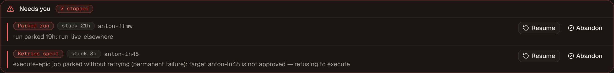
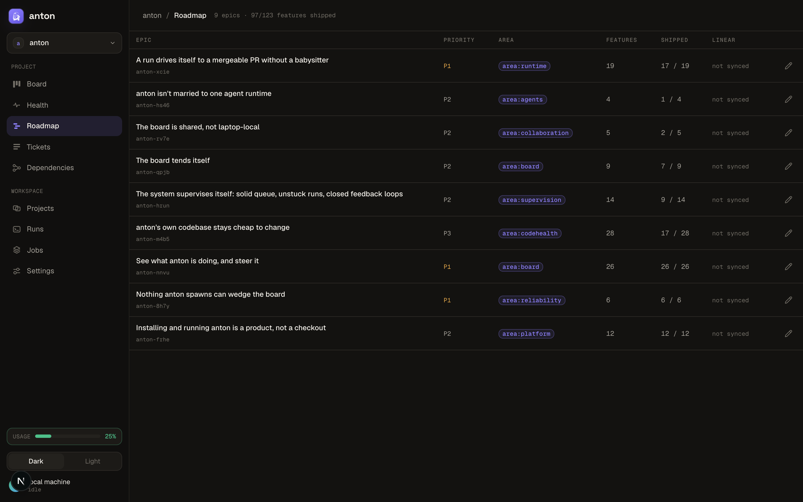
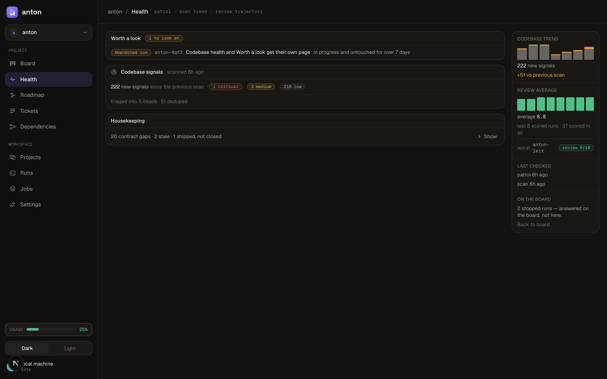
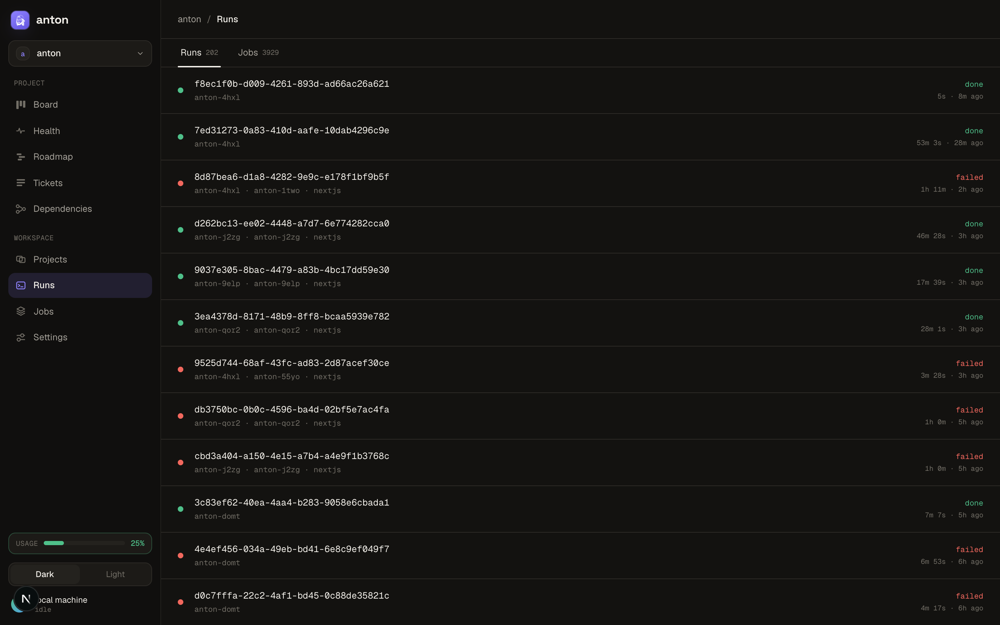

<p align="center">
  
</p>

<h1 align="center">anton</h1>

<p align="center"><strong>Shape an idea into a feature, approve it, and let it ship itself.</strong></p>

anton is a local app that turns ideas — yours, or findings from scanning your code — into merged pull requests. You describe what you want and approve the plan; anton does the rest: it spins up an isolated git worktree, drives `claude` to write the code, runs your verify gates, reviews its own diff in a fresh context, opens the PR, and keeps working it until CI is green and reviewers are satisfied.

- **You decide twice; anton does the rest.** Approve the work, merge the PR — everything between runs on its own.
- **Nothing runs unapproved.** Every piece of work is a readable contract (Goal, Acceptance, Verify) you sign off before a line is written.
- **Everything is visible.** A live board, streaming terminals, run history, review scores, a health page — and when something stalls, it surfaces as a decision for you, never a silent hang.
- **Local and private.** anton runs on your machine and drives your local `claude`, `git`, `gh`, and `bd`. Nothing to sign up for, nothing leaves your machine — unless you opt into a [shared board server](#board-modes--solo-or-team) you host yourself.

## Get started

Install with the **one-line installer**. It fetches a small (~15 MB) prebuilt bundle for your platform and drops the `anton` launcher on your `PATH` — no toolchain, no build step:

```bash
curl -fsSL https://raw.githubusercontent.com/henriblancke/anton/main/scripts/install.sh | bash
```

Then set it up and start the server:

```bash
anton setup                    # check prereqs, migrate the DB, install skills & agents
anton start                    # start the server → http://localhost:3000
open http://localhost:3000     # add a repo, shape a feature, approve, watch it run
```

anton drives your local `claude`, `git`, `gh`, and `bd` — install those first ([Prerequisites](#prerequisites)). For how the bundle works and how to manage it see [Install](#install); to hack on anton itself, run it [from source](#from-source-contributors).

## How it works

```
shape → approve → run (worktree → claude → verify gates → self-review) → PR → review-fix → merge
```

1. **Shape.** An interactive `/shape` session turns your idea into an **epic** (the product outcome) and **features** under it — each feature one PR's worth of work with Goal, Acceptance criteria, and tickets. It lands in **backlog**, unapproved.
2. **Approve.** You read the contract and click **Approve** — or **Queue**, to pace the run against your Claude usage. anton only ever executes approved work.
3. **Run.** One worktree, one PR. anton works the feature's tickets — `claude` implements (base contract + your seed prompt + the ticket's agent prompt), your verify gates check each step, and a fresh-context **self-review** scores the diff and fixes blocking findings — then it commits and opens the PR.
4. **Review-fix.** A scheduled job watches the open PR: reviewer comments and failing checks are dispatched back to `claude`, pushed, and review re-requested until the PR is clean. You merge.

> **Local, not deployed.** anton runs as a Next.js server on your machine and drives your local `claude`, `git`, `gh`, `bd`, and `stringer`. See [`DESIGN.md`](./DESIGN.md) for the full architecture.

**beads is the source of truth for work.** Epics, features, tickets, approval, stage, and the PR link all live in each repo's `.beads/` (queried via `bd`). Beads state syncs between machines via Dolt — `refs/dolt/data` on the git remote, configured by `anton setup` — so a fresh clone hydrates its board with `bd dolt pull`, not from files in the clone. The `.beads/*.jsonl` files are passive local exports for viewers: git-ignored, regenerated, and never the source of truth. That per-machine copy is the default; a team can instead point a project at one shared Dolt server and skip syncing altogether — see [Board modes](#board-modes--solo-or-team). anton's own SQLite (`anton.db`) holds only machine-local execution state: projects, runs, jobs, schedules, and sessions — it's disposable and git-ignored.

## Features

### The board


A project's home: **backlog → implementing → in-review → done**, derived from beads at read time — never a cache to reconcile. Group by stage or by epic, filter by epic or area, search everything (`⌘K`). Cards carry their epic, agent, risk, size, review score, and PR; backlog cards expose **Approve**, **Queue**, and **Claim** directly. Loose bugs and tasks surface in a **Standalone** lane, just as approvable. A **health pill** and a **sync pill** keep the scan trend and board freshness in view.

### Needs you



Nothing wedges silently. A parked run, a job out of retries, or a gate waiting on a human surfaces on the board as an escalation with the decision inline — **Resume** or **Abandon** — and disappears the moment it's settled.

### Feature detail


The approval gate. A feature shows its full contract — Goal, Acceptance, tickets, PR — beside the live **dependency graph** of its ticket DAG. Below it, the **self-review** record: each round with its score and findings, so you can see what the reviewer flagged and what got fixed before the PR opened. **Send back** reworks a feature with your notes — even after its PR opened or merged. **Open worktree** drops you into the isolated checkout.

### Roadmap



The epic-level view: every product outcome with its priority, area, and features shipped. Epics can sync to **Linear** (`bd linear sync`) if you track them there too.

### Health



How the codebase and the system are doing: **Worth a look** flags work that stalled (in progress but untouched for days), **Codebase signals** tracks each nightly scan — new signals by severity, what got triaged into beads, what was deduped — and **Housekeeping** counts contract gaps, stale claims, and shipped-but-open work. The sidebar holds the scan trend and the **review-score average** across recent runs.

### Tickets


The flat, cross-epic index: every epic, feature, and ticket with its id, epic, agent, claim, risk, and size — filterable by all of it plus title, status, type, and outcome. Where the board tracks features through stages, this is where you scan and drill in.

### Runs & jobs



**Runs** is the execution history — every worktree with its feature · ticket · agent, status, and duration. **Jobs** is the queue behind them — what's running, queued, done, or parked, with attempts, live output, an **Investigate** shortcut, and a **Force kill** for anything stuck.

### The board tends itself

Scheduled passes keep the queue healthy without you: **nightly-stringer** scans the repo and triages real signals into well-formed beads, **orphan-grooming** buckets loose tickets into approvable work, and a **product-master** pass reads the whole board and proposes reprioritizations, rehomes, splits, and kills. Every proposal is a bead you accept or decline — and per detection kind you dial autonomy from **propose** (file it and stop) through **shadow** (also record what applying would have done) to **apply** (write it, with an audit trail under Jobs).

### The pipeline is yours

The run pipeline is a bd formula at `.beads/formulas/anton-run.formula.toml` — git-tracked, project-owned, editable. **Pipeline variants** walk a different formula for beads carrying a label (say, a stricter pipeline for `risk:high`; first match wins). **Verify gates** (test, lint, typecheck, build) run in the worktree before every commit and before every review-fix push. Specialist **agent prompts** ride on `agent:` labels, and a **seed prompt** layers your conventions onto every run.

Also in a project's nav: **Dependencies**, the project-wide DAG across every epic and ticket. In the sidebar: a live Claude **usage pill** (toggle with `ANTON_USAGE_PILL`) and the workspace switcher — anton drives as many repos as you point it at.

## Prerequisites

anton drives external CLIs. Install these and make sure they're on your `PATH`:

| Tool | Required | Used for |
|------|----------|----------|
| **node ≥ 20** (or **bun**) | ✅ | runtime / package manager |
| **git** | ✅ | worktrees, commits, push |
| **bd** ([beads](https://github.com/gastownhall/beads)) | ✅ | the work source of truth |
| **claude** ([Claude Code](https://claude.com/claude-code)) | ✅ | the executor (headless + interactive) |
| **gh** ([GitHub CLI](https://cli.github.com)) | ⬜ | PRs + review-fix |
| **stringer** | ⬜ | nightly scan → beads |

### Installing them

- **node ≥ 20** — via [nvm](https://github.com/nvm-sh/nvm) (`nvm install 22`), [fnm](https://github.com/Schniz/fnm) (`fnm install 22`), Homebrew (`brew install node`), or [nodejs.org](https://nodejs.org). The prebuilt bundle self-heals its native modules for your Node version during `anton setup`, so any current major works.
- **git** — `xcode-select --install` (macOS) · `brew install git` · `apt install git` / `dnf install git` (Linux).
- **bd** (beads) — the work source of truth:
  ```bash
  curl -sSL https://raw.githubusercontent.com/steveyegge/beads/main/scripts/install.sh | bash
  ```
  Then run `bd init` inside each repo you point anton at.
- **claude** (Claude Code) — `npm install -g @anthropic-ai/claude-code`, or the native installer at [claude.com/claude-code](https://claude.com/claude-code). Run `claude` once to sign in.
- **gh** (GitHub CLI, optional) — `brew install gh` (macOS), or see [cli.github.com](https://cli.github.com) (Linux); then `gh auth login`. Without it you lose PRs + review-fix.
- **stringer** (optional) — a git-archaeology tool that mines repos for beads issues, installed via [Homebrew](https://brew.sh):
  ```bash
  brew install davetashner/tap/stringer
  ```
  Without it you lose the nightly scan → beads job. Source: [github.com/davetashner/stringer](https://github.com/davetashner/stringer).

Run `anton doctor` at any time to check what's present.

## Install

[Get started](#get-started) above shows the **one-line installer** — the quickest path. Here's what it actually does. It downloads a small (~15 MB) prebuilt, per-platform bundle — the built app plus its native modules — and drops the `anton` launcher on your `PATH`. No toolchain, no build step:

```bash
curl -fsSL https://raw.githubusercontent.com/henriblancke/anton/main/scripts/install.sh | bash
```

Then:

```bash
anton setup      # prereqs, create the local DB, install skills & agents
anton start      # start the server in the background → http://localhost:3000
```

anton **isn't a single compiled binary** — it's a Next.js server with native addons (`node-pty`, `better-sqlite3`), so a release can't fold into one universal executable. Instead each release ships a **prebuilt bundle per platform** (macOS arm64/x64, Linux x64); the installer fetches the one matching your machine, installs it under `~/.local/share/anton`, and keeps your data in `~/.local/state/anton` (so it survives updates). Manage it with `anton stop` / `status` / `update` / `uninstall` — see [Run locally](#run-locally).

### From source (contributors)

Working on anton itself? Clone and run from the checkout instead of the installer:

```bash
git clone https://github.com/henriblancke/anton && cd anton
bun install
bun link          # symlinks `anton` into ~/.bun/bin so it resolves from anywhere (npm: `npm link`)
anton setup && anton dev
```

`bun install` alone does **not** put `anton` on your `PATH` — a package manager only links a package's `bin` when it's installed as a dependency or globally, never for the repo's own root. `bun link` fixes that and keeps `anton` pointed at your working tree (edits are picked up on the next run; undo with `bun unlink`). Or skip linking and run the launcher directly: `node bin/anton.mjs <command>`. A source checkout has no `RELEASE_VERSION` marker, so `anton start` runs in the **foreground** (the daemon/`stop`/`update` commands are for installed bundles).

> **npm (once publishing is enabled).** A global `npm i -g anton` will also work as a source-style install (builds locally on your machine); anton isn't published yet, so use the installer or a clone for now.

## Run locally

```bash
anton setup      # check prerequisites, run DB migrations, rebuild node-pty
anton start      # build if needed, then start the server on http://localhost:3000
```

The server listens on **port 3000** by default. Run it elsewhere with `--port` (alias `-p`) or the `PORT` env var — an explicit flag wins:

```bash
anton start --port 4000       # or: anton start -p 4000  /  PORT=4000 anton start
anton dev --port 4000         # same override for the dev server
```

The **job runner and cron scheduler start automatically** with the server (via `src/instrumentation.ts`), so approved epics execute and scheduled jobs fire without any extra process. Set `ANTON_RUNNER=off` to boot the UI without them.

**Installed bundle vs. source checkout.** From an installed bundle, `anton start` runs the server as a **background daemon** (logs under `~/.local/state/anton/logs`) and returns once it's up; use `anton stop` / `anton status` to manage it, `anton update` to pull the latest release, and `anton uninstall` to remove it (your data in `~/.local/state/anton` is kept unless you pass `--purge`). From a source checkout there's no bundle to daemonize, so `anton start` runs in the **foreground** (add `--foreground` to force that in a bundle too).

### CLI

```
anton setup     check prereqs, migrate DB, install/refresh agents & skills  [--agents <a,b,c>|all] [--force-skills]
anton init      configure beads in a target repo + register it       [path] [--prefix <p>] [--force-skills]
anton server-mode  point one project's board at a shared Dolt server + verify it  [path] --host <h> [--port <n>] [--user <u>] --database <db> [--no-backup] [--force]
anton doctor    check prereqs + anton.db + stale skills (non-destructive)
anton board-check  report beads that break epic → feature → ticket   [path...] (default: cwd)
anton dev       run the dev server (next dev)                         [--port <n>]
anton start     run the server — bundle: background, source: foreground  [--port <n>] [--foreground]
anton stop      stop the background server                            (installed bundle)
anton status    show version, install/state paths, and running state
anton update    download & install the latest release                (installed bundle)
anton uninstall remove the installed runtime + launcher               [--purge]
anton --help    show help
```

### Agents & skills

Run in a real terminal, `anton setup` is **interactive**: after the prereq, migration, and native-build steps it provisions the agents and skills that `claude` uses, installing them into your **global `~/.claude/`** so they're discoverable from every repo `claude` runs in.

- **Bundled agents — you choose.** anton ships specialist agent prompts (`alembic`, `docker`, `fastapi`, `kubernetes`, `nextjs`, `pydantic`, `supabase`, `terraform`). Setup lists them with a one-line description each and prompts for the ones that match your stack (enter numbers, `a` for all, or Enter for none). They land in `~/.claude/agents/<tag>.md`.
- **Required skills — always installed.** The machinery anton itself needs — the `shape`, `bd`, `scan-triage`, `review`, and `review-fix` skills, plus the founder-run `setup` scaffolder — is installed automatically into `~/.claude/skills/<name>/SKILL.md` and can't be deselected.
- **Your own work is respected.** Agent prompts and any skill copy carrying local edits are left **byte-for-byte untouched** — always, and so are files you add to a skill directory. Re-running `anton setup` is idempotent: no duplicate installs, and the only thing it ever rewrites is a skill copy from an older release with nothing of yours in it (next three bullets).
- **Every shipped skill carries a version stamp.** Each `SKILL.md` declares `version: <digest>` — the content hash of its whole skill directory, recomputed by a test on every change, so it can never describe a body it no longer has. That one line is what makes an installed copy self-describing: if its stamp still matches its own content it is **untouched** (whatever release wrote it), and if it doesn't, someone **edited** it.
- **An untouched copy of an older release is refreshed for you.** Agents are yours to tune, so an edited one is simply *already present* and never nagged about. Skills are different: anton's own jobs load them as a runtime contract, so a copy left behind by an older release keeps shaping work against rules the current one has replaced. `anton setup` (global) and `anton init` (that repo) re-sync any drifted-but-untouched skill from the bundle and report it — *refreshed — was another release's copy* — because there are no edits in it to lose.
- **A copy you edited is never touched.** A skill whose stamp doesn't match its content (or that predates stamps entirely) is reported as *differs from bundle — left as-is* and left exactly where it is. `anton setup --force-skills` (global) or `anton init --force-skills` (that repo) adopts this release's version anyway; **local edits to those files are lost**, which is why it's opt-in. Files you added to a skill directory that anton doesn't ship are left alone either way.
- **`anton doctor` only reports.** It lists every drifted skill at both scopes — global `~/.claude/` and the current repo's `.claude/` — says which kind of drift each one is, and never writes a file. The global scope matters most: a plain `claude` session in any repo resolves `~/.claude/skills/` even where anton has installed nothing.
- **Non-interactive / CI.** When stdin isn't a TTY, setup skips the picker and installs just the required skills. Select agents non-interactively with `anton setup --agents nextjs,fastapi` (or `--agents all`); `--no-agents` installs skills only.

**How an agent tag resolves at run time.** When a ticket carries an `agent:<tag>` label, anton loads the prompt for `<tag>` and appends it to the run's system prompt, resolving in order: the target project's `.claude/agents/<tag>.md`, then your global `~/.claude/agents/<tag>.md`, then anton's bundled prompt. The first match wins — your customization takes precedence, and anton's bundled copy is always the fallback, so a run works even before setup installs anything.

### `anton setup` vs `anton init`

Two different scopes — run each at its own layer:

- **`anton setup` configures the anton runtime itself** — once per machine. It checks prereqs, migrates `anton.db`, heals native modules, and installs anton's skills & agents into your global `~/.claude/`. It doesn't touch any of your repos.
- **`anton init [path]` configures one target repo for anton to drive** — run it per project. It enforces anton's committed **beads** team-config (`bd init` when `.beads/` is absent → `config.yaml` keys → `.beads/.gitignore` → Dolt remote wiring over `origin`) and registers the repo with anton so it appears on the projects board. It's the terminal equivalent of adding a project from the UI — both converge to the same end state — and every step is idempotent, so a re-run (or a run on an already-configured repo) is a no-op. It needs `bd`, a git repo, and an `origin` remote; a missing one fails loud with the fix.

**Git hooks are optional for anton-driven repos.** beads normally installs `post-merge`/`post-checkout` hooks to hydrate Dolt on pull/checkout, but anton's runner pushes Dolt explicitly on every write, so hydration hooks are redundant for a repo anton drives. If a hooks manager (husky/lefthook) or a custom `core.hooksPath` already owns the repo's hooks, `anton init` **warns and prints the manual chaining steps rather than rewriting your hooks** — you can safely ignore it for anton-driven repos, or chain `bd hooks run` in yourself if you also work the repo by hand.

## Using anton

Once the server is up at `http://localhost:3000`, a full turn of work looks like this:

1. **Add a project.** From the projects screen, add a local repo that has a `.beads/` directory — or run **`anton init <path>`** in a terminal, which configures beads there and registers the repo in one step (see [`anton setup` vs `anton init`](#anton-setup-vs-anton-init)). Adding a repo from the UI records its path and detects its default branch; it self-heals the beads team-config but never rewrites your git history.
2. **Shape a feature.** Click **Add work** to open an interactive `/shape` session in the browser terminal. You talk through the idea with `claude`; together you land a **feature** — one PR's worth of work, with Goal, Acceptance criteria, Context, Out of scope and Verify — under the **epic** (the product outcome) it advances, which you pick from the board or shape on the spot. The feature lands in **backlog**, unapproved.
3. **Review and approve the feature.** Open the **feature** on the board and read its Goal, Acceptance criteria, and tickets. When it's right, click **Approve**. This is the gate: **anton only ever executes approved work.** Approval is per feature — the epic above it groups features and is never approved or run itself, so each PR gets its own decision. Nothing runs against your code until you approve.
4. **Watch it run.** On approval the feature moves to **implementing** and anton enqueues its run — one worktree, one PR. The run works through the tickets shaped under the feature (a feature with none is itself the single ticket), driving `claude` (base contract + your seed prompt + the ticket's agent prompt) to implement each one, running your test command, and committing. A live terminal streams the session; the board shows progress. When the work is done the feature moves to **in-review** with its PR link.
5. **Let review-fix work the PR.** The **review-fix** job polls each open PR. When a reviewer requests changes or CI fails, it dispatches `claude` with the PR context (comments, failing checks) to resolve them, pushes, and re-requests review — repeating until the PR is clean. You review and merge; anton keeps the loop tidy in between.

You stay in control at two points — approving the feature and merging the PR. Everything between is autonomous.

### Project settings

Each project has its own settings (under **Settings** for that project). Nothing here is required — sensible defaults apply when a field is empty.

| Section | What it controls |
|---------|------------------|
| **General** | Name, repository path, base branch runs open PRs against, and which model the headless `claude` driver uses (Opus / Sonnet / Haiku / Fable, or **Default** for `claude`'s own configured model). |
| **Active agents** | Which specialist agent prompts dispatch may assign. A ticket needing a disabled agent is **parked**, never silently run with the default. Empty (never set) = all discovered agents active. |
| **Execution prompt** | Operator guidance layered onto the locked base contract for every run — conventions, pitfalls, where key files live. It customizes *how* work is approached; it can't override the base contract. |
| **Pipeline variants** | Per-label pipeline overrides — beads carrying a matching label walk their own formula instead of `anton-run.formula.toml`; first match wins. |
| **Concurrency & limits** | Parallel runs (1–6), job/ticket timeouts, retries before parking, conventional-commit PR titles, budget-aware pacing (enables **Queue**), and the **autonomous execution** switch — when off, approvals still enqueue but nothing runs. |
| **Verify gates** | The commands that gate every commit — **test**, plus optional **lint**, **typecheck**, and **build**. Each is a shell command; a non-zero exit fails the ticket. Unset gates are skipped. |
| **Self-review** | The pre-PR review gate — on by default, findings fixed in a bounded loop. Swap the reviewer for one of the project's agents or a custom prompt. |
| **Review-fix** | Overrides the default review-fix reasoning prompt (`skills/review-fix/SKILL.md`). anton appends the concrete PR context beneath it. |
| **Automation** | Every scheduled job's on/off and cadence (see [Default schedules](#default-schedules)), plus the product-master prompt override. |
| **Proposal autonomy** | How far an automated pass may go with what it finds, per detection kind: **propose** / **shadow** / **apply**. Unattended writes are recorded under Jobs. |
| **Danger zone** | Remove the project from anton (the repo and its beads are untouched). |

### Default schedules

Default per-project schedules are seeded on project creation:

- **review-fix** — every 15 min (`*/15 * * * *`)
- **nightly-stringer** — daily at 03:00 (`0 3 * * *`)
- **orphan-grooming** — weekly, Mon 04:00 (`0 4 * * 1`)
- **run-health** — hourly stall sweep (`0 * * * *`), off by default

More job types can be put on a cron under **Automation** — **gate-check** (settle waits on human gates), **unstick** (recover wedged jobs), **gardener** (board hygiene detections), and **product-master** (whole-board proposals). Edit the cadence or disable any of them in project settings.

## Configuration

Environment variables (all optional):

| Variable | Default | Purpose |
|----------|---------|---------|
| `ANTON_DB` | `./anton.db` | SQLite path for machine-local state |
| `ANTON_RUNNER` | on | set `off` to boot the UI without the job runner + scheduler |
| `ANTON_WORKTREES_ROOT` | sibling of the repo | where run worktrees are created |
| `ANTON_SESSIONS_ROOT` | `./.anton/sessions` | claude session logs |
| `ANTON_SCANS_ROOT` | `./.anton/scans` | stringer scan files |
| `ANTON_CLAUDE_BIN` | `claude` (on `PATH`) | override the `claude` executable anton drives |
| `ANTON_GH_BIN` | `gh` (on `PATH`) | override the GitHub CLI executable |
| `ANTON_STRINGER_BIN` | `stringer` (on `PATH`) | override the `stringer` executable |
| `ANTON_USAGE_PILL` | on | live Claude usage pill (`GET /api/usage`); set falsy (`0`/`false`/`off`) to disable |

### Board modes — solo or team

Each project's beads board runs one of two ways. **Embedded is the default and needs no configuration.**

| | **Embedded** (default) | **Shared server** |
|---|---|---|
| Where the board lives | a Dolt database under `.beads/` on each machine | one `dolt sql-server` you host |
| How machines agree | `bd dolt push/pull` over `refs/dolt/data` on the git remote | they read and write the same database |
| Offline | works | needs the server reachable |
| Sync pill | **Live** / **Not wired to shared remote** / **Sync failing** | **Shared server** |
| Claims | advisory | advisory (unchanged) |

Embedded is right for one person, or for teammates who can live with push/pull lag: your board is always there, and only propagation waits on the network. **Server mode** is for a small team that wants one board in real time — every machine writes the same database, so a bead created on one is visible on the others immediately and there is nothing to sync. The trade is the obvious one: there's no local copy, so while the server is unreachable that board is unavailable. anton fails loud about it (the sync pill goes `Sync failing`, naming the configured host and port) rather than quietly drifting.

Server mode is **opt-in, per project, and self-hosted** — the server is yours; anton adds no service and no account. To turn it on, put the connection in the project's `.beads/metadata.json` (committed, so **never** a password):

```json
{
  "dolt_mode": "server",
  "dolt_server_host": "dolt.example.dev",
  "dolt_server_port": 3306,
  "dolt_server_user": "beads",
  "dolt_database": "myproject"
}
```

The password goes in the environment anton runs in, scoped to that database user — `BEADS_DOLT_PASSWORD_BEADS` for the user above (`BEADS_DOLT_PASSWORD_<USER>`, uppercased, non-alphanumerics folded to `_`), or a bare `BEADS_DOLT_PASSWORD` if every project shares one account. Add `BEADS_DOLT_SERVER_TLS=true` when the server requires TLS. Set no other `BEADS_DOLT_*` variables in a shell you launch anton from: they outrank each project's own config, and a stray `BEADS_DOLT_SERVER_DATABASE` points *every* project at that one database.

Check it with `bd dolt show` — it should name the host, port, user, and database you configured and report the server reachable — and with `bd dolt test`.

**Moving an existing embedded board onto a server** is two jobs, and anton owns only the second. The board's history is a Dolt database directory, and it reaches the server's data volume by a copy you run by hand — follow [`docs/runbooks/embedded-board-to-shared-dolt-server.md`](./docs/runbooks/embedded-board-to-shared-dolt-server.md), validated end to end. Then `anton server-mode <repo> --host <host> --database <db>` does the config half: it writes the metadata above, verifies the board reads back whole, and puts the old file back if it doesn't. `bd export` → `bd import` is **not** a substitute — it moves the issues and drops the board's Dolt commit history. The embedded `.beads/embeddeddolt/<db>/` copy stays where it is throughout: it's the history backup and the way back.

Full behaviour, including what each mode does when the network or the server goes down, is in [`DESIGN.md` §3a](./DESIGN.md#3a-board-modes--embedded-vs-shared-server).

## Troubleshooting

**`anton setup`/`doctor` reports a MISSING required tool.** anton can't run without `git`, `bd`, `claude`, and node ≥ 20. Install the flagged tool, make sure it's on your `PATH`, and re-run `anton doctor` until every required row shows `found`. `gh` and `stringer` are optional — without `gh` you lose PRs and review-fix; without `stringer` you lose the nightly scan.

**The live terminal / interactive `/shape` session doesn't work.** anton uses `node-pty`, whose prebuilt binaries don't always match your local node ABI. `anton setup` rebuilds it best-effort, but if the rebuild was skipped or failed, rebuild it manually:

```bash
cd node_modules/node-pty && npx node-gyp rebuild
```

Then restart the server. (A node upgrade can break the ABI again — re-run the rebuild after upgrading node.)

**The UI boots but nothing executes.** Approved epics run only when the job runner is on. If you started with `ANTON_RUNNER=off`, the UI comes up but the runner and scheduler don't — restart without that variable so runs execute and scheduled jobs fire. Conversely, set `ANTON_RUNNER=off` when you *want* the UI without any background execution (e.g. inspecting state).

**A run never opens a PR, or review-fix does nothing.** These need `gh` authenticated against the repo's remote. Check `gh auth status` and that the project's remote is reachable. review-fix also only acts once a PR exists and a reviewer has requested changes or a check has failed.

**`anton init`/`doctor` says the shared Dolt server is UNREACHABLE.** On a server-mode board there is no local copy, so anton refuses to configure (or reports red for) a repo whose server it can't reach, naming the configured `host:port/database`. Same causes and same fixes as the sync-pill entry below — reach the server, correct `.beads/metadata.json`, export the password variable — or set `dolt_mode` back to `"embedded"` to work from this machine's copy until the server is back. `anton doctor` exits non-zero while it's unreachable, so it's safe to gate a script on.

**The sync pill says `Sync failing` on a shared-server board.** anton preflights the shared Dolt server and reports the configured host, port, and database in the error. Check that the server is up and reachable from this machine, that `.beads/metadata.json` names the right host/port/user, and that the password variable for that user (`BEADS_DOLT_PASSWORD_<USER>`, or `BEADS_DOLT_PASSWORD`) is set **in the environment anton itself was started from** — a `direnv` approval that never got granted is a common cause. No restart is needed once it's fixed: the next heartbeat picks the server back up. To keep working while the server is down, a machine that still has its old embedded database can set `dolt_mode` back to `"embedded"` — see [Board modes](#board-modes--solo-or-team).

**`anton doctor` shows `anton.db not created`.** Run `anton setup` — it applies the Drizzle migrations that create/update `anton.db`. `anton.db` is disposable machine-local state; deleting it and re-running `anton setup` is a safe reset (your work lives in beads + git, not here).

**`anton doctor` flags a drifted skill.** The copy in `~/.claude/skills/` (or the repo's `.claude/skills/`) isn't the one this release ships, so `/shape` will keep shaping work against rules the current release has replaced. What to do depends on which drift doctor names:

- *is another release's copy* — untouched, so just re-run `anton setup` (global) or `anton init` (that repo); it refreshes automatically, no flag.
- *carries local edits* / *predates version stamps* — anton won't overwrite it. Adopt this release's version with `anton setup --force-skills` / `anton init --force-skills` (**your edits are discarded**), or ignore the warning if the difference is deliberate.

Either way, restart any running `claude` session afterwards: skills are read at session start, so an updated file doesn't reach a session already open.

**`/shape` produced a board that doesn't match `epic → feature → ticket`.** Run `anton board-check` in that repo (or pass one or more repo paths) for every violation on the board and the `bd` command that fixes each one. It exits non-zero only on a *dead* bead — one no run will ever reach, such as a ticket left under an epic that has features under it. Features outside the 2–6 ticket budget, features with no epic, and beads whose parent isn't on the board print as advisories: they run, they just cost you later. The same judgement gates approval for the target being approved, so a dead bead can't reach a run. It needs `bd` on PATH and nothing else — no anton checkout, no build.

## Stack

Next.js 16 (App Router, RSC) · React 19 · Tailwind 4 · shadcn/ui · Drizzle + better-sqlite3 · node-pty + @xterm/xterm · in-process durable job runner · bun (pm) / node (runtime).

## Contributing

Setup, quality gates, CI, and release process live in [`CONTRIBUTING.md`](./CONTRIBUTING.md).
