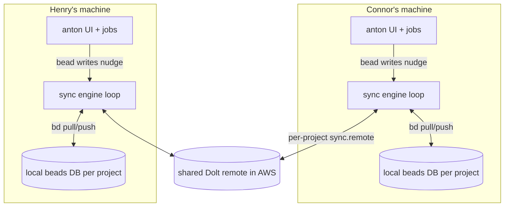

# Beads Live Sync — Requirements

## Summary

Add a per-project serialized sync engine to anton that keeps each managed project's local beads (Dolt) DB continuously in sync with that project's configured shared Dolt remote — heartbeat pull, write-nudged push, and session-end sync — plus ticket claiming with operator assignment, visible sync status, and a board UI that polls for freshness. Includes the foundation fixes that make Dolt the real cross-machine channel instead of git-tracked JSONL exports.

---

## Problem Frame

Multiple people (e.g. Connor and Henry) and their anton-driven Claude sessions now work the same beads backlogs. Each machine has its own local beads DB, and nothing in anton pushes or pulls Dolt data — an external investigation confirmed that beads' git hooks are dead in husky-managed repos (husky owns `core.hooksPath`), `dolt.auto-commit` is off, and no Dolt remote is configured in this repo. The only thing crossing machines is the git-tracked `.beads/issues.jsonl` / `interactions.jsonl` — monolithic exports rewritten on every beads change — which is the exact anti-pattern the beads docs warn against and the direct cause of the painful merge conflicts already experienced.

Two compounding gaps: boards fetch once on mount and never refresh, so even local state goes stale on screen; and execution sessions never mark tickets `in_progress` or assign them, so an in-flight ticket looks idle and teammates can't tell what's claimed. The result is people stepping on each other's work.

---

## Key Decisions

- **Explicit sync engine over git-hook-based sync.** Hooks are provably dead under husky and are fragile even when alive. Anton owns sync explicitly; repairing hook chaining is at most optional hardening.
- **One serialized sync loop per managed project, not inline sync per operation.** All Dolt pull/push for a project flows through a single queue: every push is preceded by a pull, operations never overlap on a machine, and there is one place to retry and surface failures. This minimizes the conflict windows that inline push-on-every-write would multiply.
- **Build on bd's native sync (`sync.remote`), not raw Dolt plumbing.** Projects configure their remote in `.beads/config.yaml` (AWS remote — DynamoDB manifest + S3 — is the standard, as in knowledge-layer). Anton drives `bd`-level sync against whatever remote is configured, keeping beads swappable and merge mechanics out of anton.
- **Sync scope is per managed project.** Claude sessions run in worktrees of separate repos, each with its own `.beads` DB and remote. Anton's own repo is just another project. The engine, status surfacing, and remote-wiring checks all operate per project.
- **Transition-point sync instead of in-session hooks.** Anton's runner already drives every session start/finish; syncing at those points plus session end covers agent-made bead changes. No Claude Code hooks are installed into sessions.
- **Assignee is the human operator.** When a session works a bead, the bead is assigned to the person whose anton launched it — the board shows which human's pipeline holds what.
- **Freshness target is ~10–20s across machines, not instant.** Polling and heartbeats, no new real-time infrastructure.

---

## Requirements

**Foundation — make Dolt the real sync channel**

- R1. Every anton-managed project has a Dolt remote wired (`sync.remote` in `.beads/config.yaml`); anton verifies this per project and treats a missing remote as a visible degraded state, not a silent local-only mode.
- R2. Beads writes produce real Dolt commits (not just working-set changes) so there is always something to push.
- R3. The git-tracked JSONL exports (`.beads/issues.jsonl`, `.beads/interactions.jsonl`) are untracked and excluded from commits, removing the accidental sync channel and its merge conflicts.
- R4. R3 lands only after Dolt sync (R1–R2 plus the engine below) demonstrably works for that project, so cross-machine sync is never lost in the transition.

**Sync engine**

- R5. Anton runs one serialized sync loop per managed project; all Dolt pull/push for that project goes through it, and operations never overlap.
- R6. The loop heartbeats on an interval (~10s) with a pull, so remote changes land locally without any local activity.
- R7. Every bead write anton performs nudges the loop to sync immediately (pull, then push).
- R8. When a Claude session ends (ticket run, review-fix, scan-triage, or any job session), anton syncs that project so bead changes the agent made via `bd` in the worktree reach the remote.
- R9. Sync failures are retried and surfaced; a failing sync never blocks reads or bead writes, which always operate on local state.

**Claiming and assignment**

- R10. When anton starts work on a ticket, it claims it: status `in_progress`, stage label, and assignee set to the human operator who owns that anton instance — followed by an immediate sync nudge so the claim is visible to others quickly.
- R11. When work on a bead finishes or aborts, its status reflects reality (closed, back to ready, or flagged), so no bead is left looking claimed by a dead session.

**UI liveness and status**

- R12. The board (and other bead-derived views) refreshes automatically on an interval (~10s) instead of fetching once on mount.
- R13. Each project surfaces its sync status in the UI: live/synced (with recency), syncing, failing (with cause), or not-wired (no remote configured).

---

## Key Flows

- F1. Claim visibility across machines
  - **Trigger:** Connor's anton starts executing a ticket.
  - **Steps:** anton claims the ticket (R10) → sync nudge pushes to the shared remote → Henry's heartbeat pull lands the change → Henry's board poll re-renders.
  - **Outcome:** Within ~10–20s, Henry's board shows the ticket `in_progress`, assigned to Connor.
  - **Covers:** R5–R7, R10, R12.

- F2. Agent-made bead changes reach the team
  - **Trigger:** A Claude session in a project worktree creates or closes beads via `bd` (e.g. scan-triage).
  - **Steps:** session ends → anton runs session-end sync for that project → changes push to the remote.
  - **Outcome:** New/closed beads appear on every teammate's board at the next heartbeat + poll.
  - **Covers:** R8.

- F3. Sync failure stays visible, work continues
  - **Trigger:** The shared remote is unreachable during a push.
  - **Steps:** the loop retries with backoff, marks the project's sync status failing → UI shows the failure and last-synced time → local reads/writes proceed normally → on recovery the loop drains pending sync.
  - **Outcome:** No lost writes, no blocked UI, and no one mistakes stale data for live data.
  - **Covers:** R9, R13.

---

## Acceptance Examples

- AE1. **Covers R10, F1.** Given Henry has the board open for a shared project, when Connor's anton begins a ticket, then within ~20s Henry's board shows that ticket `in_progress` with Connor as assignee, without Henry refreshing the page.
- AE2. **Covers R1, R13.** Given a project with no `sync.remote` configured, when anton loads its board, then the UI shows a "not wired to shared remote" status and no sync loop churn — never a silent local-only mode.
- AE3. **Covers R4.** Given a project where JSONL exports are still git-tracked, when the foundation migration runs, then JSONL untracking happens only after a verified round-trip (push from one machine, pull on another) against the Dolt remote.
- AE4. **Covers R9.** Given the AWS remote is down, when anton writes beads, then writes succeed locally, the board keeps rendering local state, and the sync status shows failing with last-synced recency.

---

## Scope Boundaries

- In-session Claude Code hooks that fire on every bead change — transition-point and session-end sync covers the need; hooks add an install surface and widen conflict windows.
- Websockets or server-push board updates — polling meets the ~10–20s freshness target.
- A hosted Dolt SQL server as the live database everyone points at — the escape hatch if sync-based coordination still hurts at larger team size, not v1.
- Repairing husky→beads git-hook chaining — optional hardening only; the sync engine must not depend on it.
- Conflict *resolution* UX — cell-level Dolt merges make textual conflicts rare once JSONL is untracked; surfacing a rare real conflict for manual resolution is enough for v1.

---

## Dependencies / Assumptions

- The centralized AWS Dolt remote (DynamoDB manifest + S3) exists and is reachable from all operators' machines; knowledge-layer's `sync.remote` is the working example.
- `bd` supports the sync operations the engine needs (pull, push, commit) against an `aws://` remote in embedded-Dolt mode.
- Each operator's anton instance knows its owner's identity (for R10 assignee); if no identity config exists yet, one must be added.
- The coworker investigation's findings (dead hooks, no pushes, tickets never `in_progress`) are accurate as of 2026-07-14 and were partially verified in-repo (no remotes in `.beads/embeddeddolt/*/repo_state.json`, no sync calls in `src/lib/beads/bd.ts`).
- `bd` handles git worktrees via a `redirect` file pointing at the main checkout's `.beads/`, so session writes in worktrees land in the project's DB — R8 needs no separate merge-back path.
- In anton's own repo the foundation is partially landed already: JSONL exports are gitignored, `dolt.auto-commit = on`, `export.git-add = false`. R1–R4 for this repo reduce to wiring `sync.remote` and verifying a round-trip; other managed projects need per-project verification.

---

## Outstanding Questions

**Deferred to planning**

- What bd's native auto-sync/daemon already does when `sync.remote` is set (`.beads` runtime files reference `sync-state.json`, `daemon.*`, and a `--sandbox` flag that "disables auto-sync") — the engine should supervise it, not fight it.
- Heartbeat and poll intervals (start ~10s; tune for Dolt operation cost).
- Whether ticket-detail and epic-detail views poll at the same cadence as the board.
- How operator identity is configured (per-instance setting vs derived from git user).
