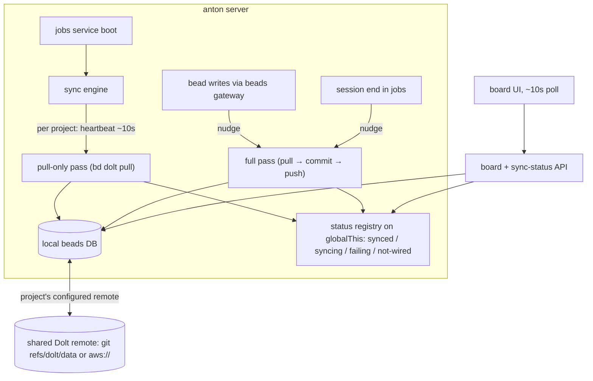

# feat: Beads live sync — heartbeat pull, operator claiming, sync status, board polling

## Summary

Extend anton's existing push-on-write Dolt sync into a full live-sync loop: a per-project heartbeat that pulls remote changes, pull-before-push serialization, ticket claiming that sets the assignee to the human operator, per-project sync status in the UI, and a board that polls for freshness. The engine is remote-agnostic — it drives whatever Dolt remote each project's beads config declares (git-origin `refs/dolt/data` or `aws://`).

---

## Problem Frame

Multiple operators and their anton-driven Claude sessions share the same beads backlogs, each with a local Dolt DB (see origin: docs/brainstorms/2026-07-14-beads-live-sync-requirements.md). PR #6 (`cfa51d1`), #8, and #9 already shipped half the brainstorm's foundation: coalesced push-on-every-write (`createDoltSync` in `src/lib/beads/bd.ts`), session-end sync in a `finally` (`src/lib/jobs/execute-epic.ts`), ticket `in_progress` claiming, JSONL untracking, `dolt.auto-commit: on`, husky→bd hook chaining, and Dolt remote wiring at `anton setup`/`init`.

What's still missing is the inbound half and the visibility layer: **nothing ever pulls** (bd has no auto-pull; remote changes never land locally), pushes are not preceded by pulls (diverged-remote pushes fail), claiming sets status but **no assignee**, the board fetches once on mount and never refreshes, and sync health is invisible. A teammate's claim is unknowable until a manual pull, so people still step on each other's work.

---

## Requirements

**Sync engine**

- R1. Each registered project has a heartbeat (~10s) that pulls from its configured Dolt remote, so remote changes land locally without local activity.
- R2. Write-nudged sync passes order pull before commit/push; heartbeat passes are pull-only (no push without local changes); per-project sync operations never overlap (extend the existing coalescing serialization).
- R3. The engine drives whichever remote the project's beads config declares — git-origin or `aws://` — with no remote-type logic in anton beyond invoking `bd dolt pull`/`push`.
- R4. Sync failures are retried with backoff and surfaced as state; they never block reads or bead writes, which always operate on local data.
- R5. A project with no Dolt remote configured is a visible `not-wired` state, and its heartbeat idles instead of churning.

**Claiming and assignment**

- R6. When anton starts work on a ticket, the claim sets assignee to the human operator (bd actor resolution: `BEADS_ACTOR` env, else git `user.name`) in addition to `in_progress` + stage label, followed by a sync nudge.
- R7. Claiming stays idempotent and non-fatal (existing `safe()` pattern) so resumed runs and sync failures never break a job.
- R10. When a ticket run fails or aborts, the claim is released — status leaves `in_progress` and the bead is unassigned or flagged — followed by a sync nudge, so no bead stays claimed by a dead session.

**UI liveness and status**

- R8. The board auto-refreshes on an interval (~10s) while visible, replacing fetch-once-on-mount.
- R9. Each project's sync status renders in the UI: synced (with recency), syncing, failing (with cause), or not-wired.

---

## Key Technical Decisions

- **Extend `createDoltSync`, don't replace it.** Its non-overlap + trailing-coalesce semantics (keyed by cwd) are the serialization invariant R2 needs, and it's already tested (`src/lib/beads/bd.ts`, `bd-sync.integration.test.ts`). The change is adding a pull step to `runDoltSync` and layering a heartbeat + status tracker on top.
- **Heartbeat lives in the jobs service boot path.** `src/lib/jobs/service.ts` already starts the runner + cron scheduler once at server boot (`src/instrumentation.ts`); the sync engine starts there, iterating registered projects from `src/lib/projects.ts`.
- **Remote-agnostic via bd.** bd resolves the remote from the project's own config (`sync.remote` in `.beads/config.yaml`, or the embedded remote added by `anton setup`); anton never inspects the remote URL. `anton init`/`setup` must respect a pre-existing `sync.remote` (e.g. knowledge-layer's `aws://` remote) instead of forcing git-origin over it.
- **Claim via `bd update --claim` semantics with explicit actor.** bd 1.0.2 supports `--claim` (atomic assignee+status, idempotent) and `-a/--assignee`. Anton passes the operator identity explicitly (`--assignee` or `BEADS_ACTOR` on the child process) rather than trusting whatever user the server process runs as.
- **"No remote configured" splits from benign.** `isBenignSyncOutput` currently swallows it; the engine reclassifies it as `not-wired` status (R5) while writes stay non-failing. Push/pull benign cases from the integration test (first-ever pull before `refs/dolt/data` exists; nothing to commit) stay benign.
- **Consider disabling bd's own auto-push where anton runs the engine.** bd 1.0.2 auto-pushes post-command when a remote named `origin` exists (5m debounce); upstream 1.1.0 made it opt-in because concurrent pushes to git+ssh remotes can corrupt the remote manifest. Anton's explicit engine makes auto-push redundant; setting `dolt.auto-push: false` in managed projects removes a double-push race. Decide at implementation against observed behavior.
- **Polling over SSE/websockets.** ~10–20s freshness target (see origin) doesn't justify streaming infrastructure; the board already has a fetch path to re-trigger, and runs views already poll at 2.5s as precedent (`src/components/runs/run-detail-view.tsx`).

---

## High-Level Technical Design

State per project: `not-wired → idle → syncing → idle` on success, `syncing → failing (retry with backoff) → idle` on recovery; `lastSyncedAt` and last error carried alongside.

---

## Implementation Units

### U1. Pull-aware sync passes and status tracking in the beads gateway

- **Goal:** The gateway gains two pass types — full (pull → commit → push) for write nudges, pull-only for heartbeats — and a per-cwd status record (state, lastSyncedAt, lastError) that updates on every pass.
- **Requirements:** R2, R3, R4, R5.
- **Dependencies:** none.
- **Files:** `src/lib/beads/bd.ts`, `src/lib/beads/bd.test.ts`, `src/lib/beads/bd-sync.integration.test.ts`.
- **Approach:** Write-nudging already exists from PR #6 — every beads write path calls the coalescing `doltSync(cwd)`; this unit extends that mechanism, it does not create it. Add `["dolt", "pull"]` ahead of commit/push in `runDoltSync`, and add a pull-only variant for heartbeat use: heartbeats must not push when there are no local changes, or every anton instance pushes the shared remote every ~10s — the concurrent-push manifest-corruption pattern (GH#2466) at cross-machine scale. Split "no remote configured" out of `BENIGN_SYNC_OUTPUT` into a distinct `not-wired` outcome that resolves the pass without error but records state. Keep first-ever-pull failure (no `refs/dolt/data` yet) benign per the existing integration-test taxonomy. The status registry is anchored on `globalThis` (symbol-keyed), the standard Next.js cross-bundle singleton pattern — instrumentation-started engine code and API route handlers can load different compiled instances of this module, and a plain module-level Map would leave routes reading an empty registry.
- **Patterns to follow:** existing `createDoltSync` coalescing and rejection-bookkeeping comments; error classification in `bd-sync.integration.test.ts`.
- **Test scenarios:**
  - A write-nudged full pass runs pull, commit, push in order; after a remote change it leaves the local DB containing the remote's rows (integration).
  - A heartbeat pull-only pass never invokes push, even when the working set has local changes (those wait for the next nudge).
  - Pull failure on a never-pushed remote is benign; a full pass proceeds to push (covers first-setup).
  - "No remote configured" yields `not-wired` status, no thrown error, and no push attempt.
  - A real push failure (diverged remote) sets `failing` with the bd output as cause; a subsequent successful pass returns to `synced`.
  - Concurrent sync requests for one cwd still coalesce to one trailing run (existing tests keep passing).

### U2. Per-project heartbeat engine at server boot

- **Goal:** Every registered project syncs on a ~10s heartbeat, serialized through U1's machinery, started once at boot.
- **Requirements:** R1, R4, R5.
- **Dependencies:** U1.
- **Files:** `src/lib/beads/sync-engine.ts` (new), `src/lib/beads/sync-engine.test.ts` (new), `src/lib/jobs/service.ts`, `src/lib/projects.ts` (read-only use).
- **Approach:** Interval per project path calling U1's pull-only pass (write nudges, not heartbeats, own pushing); `not-wired` projects idle at a slower recheck (e.g. 60s) instead of full-rate churn; failure backoff caps retries between heartbeats. Idempotent start guard mirrors `startRunner` (`src/lib/jobs/service.ts`).
- **Test scenarios:**
  - Boot starts one heartbeat per registered project; a second start call is a no-op.
  - A `not-wired` project drops to the slow recheck cadence and recovers to full rate once a remote appears.
  - A failing project backs off (no tight retry loop) and re-syncs on the next heartbeat after recovery.
  - Engine keeps heartbeating other projects when one project's sync throws.

### U3. Operator-assigned claiming

- **Goal:** Ticket (and epic) claims set assignee to the human operator, visible via the existing "claimed by" UI.
- **Requirements:** R6, R7.
- **Dependencies:** none (parallel to U1/U2).
- **Files:** `src/lib/beads/bd.ts` (claim method), `src/lib/jobs/execute-epic.ts`, `src/lib/jobs/review-fix.ts` (if it claims), settings surface for operator identity (`src/lib/settings.ts` or equivalent), tests alongside each.
- **Approach:** Add `beads.claim(cwd, id, actor)` using `bd update <id> --claim` with the actor supplied explicitly (`BEADS_ACTOR` in the child env, or `--assignee`). Operator identity resolves from anton settings when set, else git `user.name`. Replace the bare `setStatus(..., "in_progress")` at `runTicket` and the epic-claim site; keep `safe()` + idempotency.
- **Test scenarios:**
  - Covers the claiming step of AE1 (origin; the full cross-machine flow also needs U1/U2/U5): starting a ticket sets `in_progress` and assignee = operator, then nudges sync.
  - Re-running a claim on an already-claimed-by-me ticket is a no-op success (resume path).
  - Claim failure (bd error) logs and does not abort the run.
  - Operator identity: settings value wins over git `user.name`; missing both falls back to bd's `$USER` resolution without crashing.

### U4. Sync status API and UI indicator

- **Goal:** Per-project sync status is queryable and rendered where the board lives.
- **Requirements:** R9, R5.
- **Dependencies:** U1, U2.
- **Files:** `src/app/api/projects/[slug]/board/route.ts` (embed status in board payload) or a sibling status route, `src/lib/board.ts`, `src/components/board/epic-board.tsx` (indicator), component test.
- **Approach:** Cheapest path is embedding `{ state, lastSyncedAt, lastError }` in the board response from U1's status accessor; a small header badge renders synced-recency / syncing / failing (with cause on hover or detail) / not-wired.
- **Test scenarios:**
  - Status read through the API route reflects a sync pass triggered from the instrumentation-side engine (proves the `globalThis` registry crosses the bundle boundary).
  - Board payload carries each state correctly, including `not-wired` for an unconfigured project (covers AE2, origin).
  - Failing state renders the cause and last-synced recency (covers AE4, origin).
  - Status degrades gracefully when the engine hasn't run yet (fresh boot).

### U5. Board polling

- **Goal:** The board refreshes itself every ~10s while visible.
- **Requirements:** R8.
- **Dependencies:** none (lands with or before U4 for combined effect).
- **Files:** `src/components/board/epic-board.tsx`, board component tests.
- **Approach:** Interval re-fetch following the `run-detail-view.tsx` polling precedent; pause when `document.visibilityState` is hidden; preserve in-flight DnD interactions (skip applying a poll result mid-drag).
- **Test scenarios:**
  - Board re-fetches on the interval and re-renders changed cards without remount flicker.
  - Poll pauses when the tab is hidden, resumes on visibility.
  - A poll landing during an active drag does not clobber the drag state.
  - Fetch errors during polling keep the last good board and don't spam error UI.

### U6. Remote wiring respects per-project config

- **Goal:** `anton init`/`setup` honor an existing `sync.remote` (e.g. `aws://`) instead of forcing git-origin, and report the effective remote.
- **Requirements:** R3, R5.
- **Dependencies:** none.
- **Files:** `bin/anton.mjs` (`configureBeadsDoltSync`), `src/lib/beads/config.mjs`, `bin/anton.test.ts`.
- **Approach:** Before adding git-origin as the Dolt remote, check `bd config get sync.remote` / `bd dolt remote list`; if a remote is already declared (any scheme), leave it and report it. Detection must parse output text, not exit codes: `bd config get sync.remote` exits 0 with `sync.remote (not set in config.yaml)` when unset (verified on bd 1.0.2) — treat output matching `(not set` as absent, and keep the existing `bd dolt remote list` line-parse ("No remotes configured.") as the second signal. Keep the existing URL-normalization equality check for the git-origin path. Optionally set `dolt.auto-push: false` here per the KTD (decide at implementation).
- **Test scenarios:**
  - Project with `sync.remote: aws://...` keeps it; setup reports the AWS remote and does not add git-origin.
  - Project with no remote gets git-origin wired (current behavior preserved).
  - Stale git-origin URL still gets re-pointed (existing behavior preserved).
  - Setup output distinguishes wired / already-wired / no-remote-available outcomes.

### U7. Stale-claim release on failed or aborted runs

- **Goal:** A ticket run that fails or aborts releases its claim so the bead never stays `in_progress` under a dead session's operator.
- **Requirements:** R10, R7.
- **Dependencies:** U3.
- **Files:** `src/lib/jobs/execute-epic.ts`, `src/lib/beads/bd.ts` (release/unassign method), `src/lib/jobs/execute-epic.integration.test.ts`.
- **Approach:** In the run's failure path (the existing `catch`/`endSession(..., "failed")` flow), release the ticket's claim inside `safe()`: revert status from `in_progress` to open/ready and clear the assignee — or, when partial work landed (branch pushed, PR open), tag it for attention instead of silently re-queueing. Follow with a sync nudge so the release is visible to teammates quickly. Successful completion already closes the ticket (existing behavior).
- **Patterns to follow:** the `safe()` + logged-not-thrown convention in `execute-epic.ts`; sync-in-`finally` already covers the push.
- **Test scenarios:**
  - A ticket run that throws mid-session leaves the ticket unclaimed (not `in_progress`, no assignee) and the failure doesn't mask the original error.
  - A run that fails after pushing a branch/PR tags the ticket for attention instead of reverting to ready.
  - Release is idempotent — a resumed or double-failed run doesn't error on an already-released ticket.
  - Release failure (bd error) logs and never replaces the run's real error.

---

## Scope Boundaries

Carried from origin: no in-session Claude Code hooks (transition-point + session-end sync covers it); no websockets/streaming; no hosted Dolt SQL server; conflict-resolution UX beyond surfacing failures is out.

### Deferred to Follow-Up Work

- Ticket/epic detail views polling (board first; add if the board pattern proves out).
- Migrating existing projects' remotes between git-origin and `aws://` (this plan only respects what's configured; a migration command is follow-up).
- bd 1.0.2 → 1.1.0 upgrade evaluation (auto-push semantics change; `--remote` flag).

---

## Risks & Dependencies

- **Diverged-history pushes**: bd's non-forced push fails on divergence with manual recovery guidance (`bd bootstrap` / `--force`). Pull-before-push shrinks the window but a true divergence (two `bd init`s) needs human action — the `failing` status with bd's output is the surfacing mechanism, not auto-repair.
- **Double-push race with bd auto-push**: bd 1.0.2 auto-pushes when a remote named `origin` exists; concurrent git+ssh pushes risk remote-manifest corruption (upstream GH#2466). Mitigation in U6 KTD. Cross-machine exposure is bounded by the pull-only heartbeat (U1/U2): anton instances push only when they have local changes, not on every beat.
- **Embedded Dolt is single-writer**: heartbeat syncs, job writes, and API writes all funnel through `bd` CLI invocations against the embedded DB; the coalescing serialization keeps anton-side pressure low, but agent `bd` calls in worktrees share the same DB (git common-directory discovery). Watch for lock contention in integration testing.
- **AWS credentials**: `aws://` remotes authenticate via the standard AWS SDK chain; a machine without credentials will surface as `failing` — acceptable, but setup docs should mention it.

---

## Sources / Research

- Baseline commits: `cfa51d1` (PR #6, sync + claiming + JSONL), PR #8 (`anton init` per-project beads config), PR #9 (claimed-by UI).
- bd 1.0.2 behavior verified locally: `--claim`/`--assignee` flags, actor resolution (`BEADS_ACTOR` → git `user.name` → `$USER`), no auto-pull, auto-push semantics, `aws://` remote scheme support, worktree DB sharing via git common-directory discovery.
- Upstream beads docs: `docs/core-concepts/sync-concepts.md` (Dolt remote is the wire format; JSONL is a passive export; anti-patterns), `docs/reference/git-integration.md`.
- Existing sync taxonomy: `src/lib/beads/bd-sync.integration.test.ts` (empty-remote push, first-pull-before-refs-exist, remote URL normalization).
